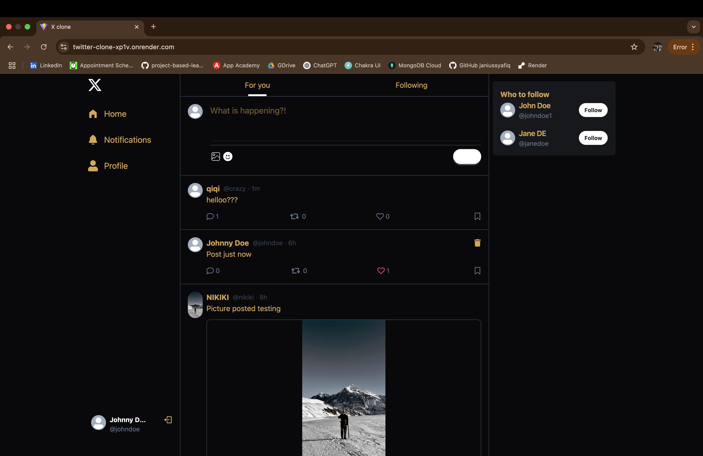
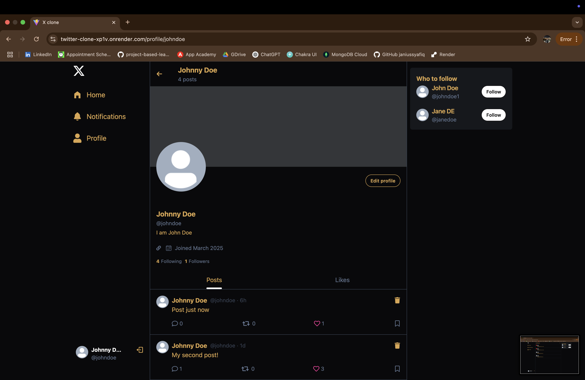

# **Twitter Clone 🐦**  

A **full-stack social media web application** built with the **MERN stack (MongoDB, Express.js, React, Node.js)** that allows users to **post, like, comment, follow/unfollow users**, and update their profiles. The app is styled with **Daisy UI & Tailwind CSS**, optimized with **Vite**, and uses **TanStack React Query** for efficient API state management.

## 🌟 **Features**
- ✅ **User Authentication** – Secure login & signup using JWT authentication.  
- ✅ **Post Tweets** – Users can create posts with text and images.  
- ✅ **Like & Comment** – Engage with posts by liking and commenting.  
- ✅ **Follow & Unfollow Users** – Connect with other users easily.  
- ✅ **Profile Management** – Edit bio, change profile/cover pictures, and update details.  
- ✅ **Optimized UI with Tailwind & Daisy UI** – A clean, modern, and accessible design.  
- ✅ **Real-time UI Updates** – Optimistic updates for following/unfollowing and likes using **TanStack Query**.  
- ✅ **Toast Notifications** – Get instant feedback on actions (likes, follows, errors, etc.) with **React Hot Toast**.  
- ✅ **Upcoming: Real-time Notifications & Hashtags** 🚀  

---

## 🛠 **Tech Stack**
| Frontend  | Backend  | Database | Deployment |
|-----------|---------|----------|------------|
| React.js  | Node.js  | MongoDB  | Render (Backend) |
| Vite  | Express.js  | Mongoose  | |
| Tailwind CSS  | JWT Auth  | Cloudinary (for images)  | |
| Daisy UI  | bcrypt.js  | | |

---

## 🚀 **Live Demo**
🔗 **Try the app here:** [Twitter Clone](https://twitter-clone-xp1v.onrender.com/)  

### 📸 **Screenshots**
| Home Page | Profile Page |
|-----------|-------------|
|  |  |

---

## 📦 **Installation & Setup**
### **1️⃣ Clone the Repository**
```sh
git clone https://github.com/janiussyafiq/twitter-clone.git
cd twitter-clone
npm run build
npm run start
