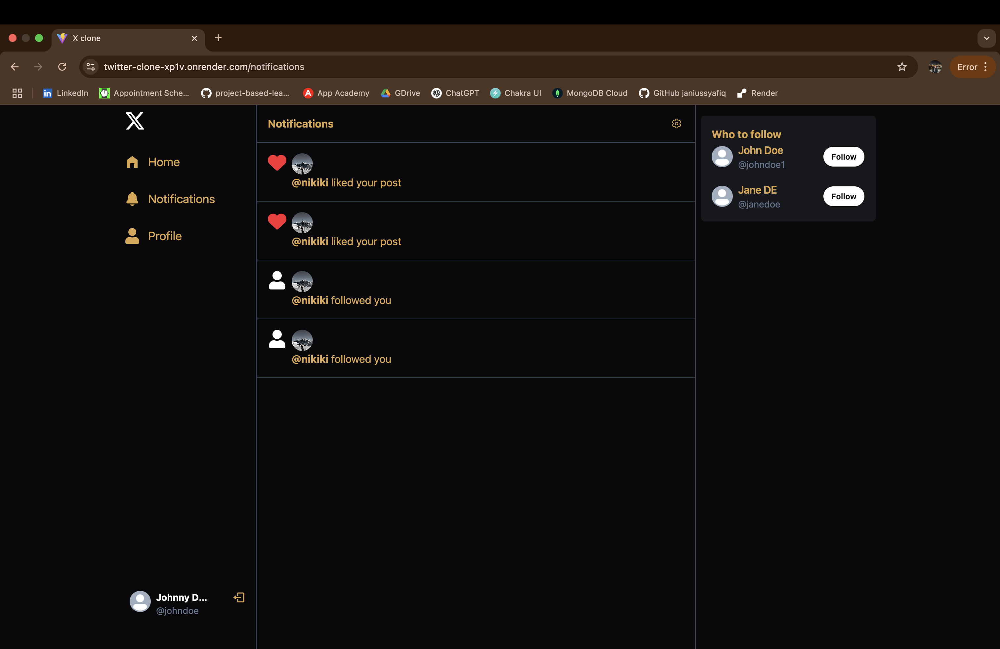
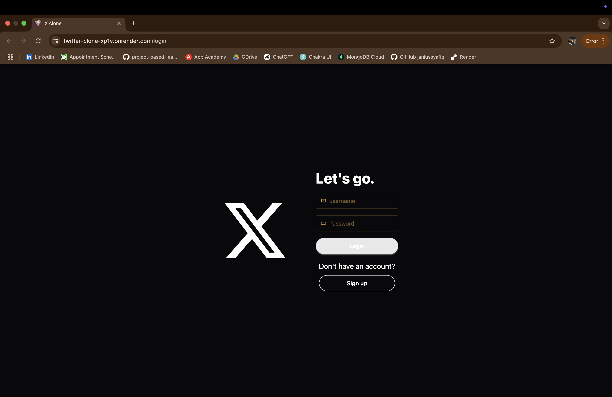

# **Twitter Clone 🐦**  

A **full-stack social media web application** built with the **MERN stack (MongoDB, Express.js, React, Node.js)** that allows users to post, like, comment, follow/unfollow users, and update their profiles. The app is styled with **Daisy UI & Tailwind CSS**, optimized with **Vite**, and uses **TanStack React Query** for efficient API state management.

## 🌟 **Features**
- ✅ **User Authentication** – Secure login & signup using JWT authentication.  
- ✅ **Post Tweets** – Users can create posts with text and images.  
- ✅ **Like & Comment** – Engage with posts by liking and commenting.  
- ✅ **Follow & Unfollow Users** – Connect with other users easily.  
- ✅ **Profile Management** – Edit bio, change profile/cover pictures, and update details.  
- ✅ **Optimized UI with Tailwind & Daisy UI** – A clean, modern, and accessible design.  
- ✅ **Real-time UI Updates** – Optimistic updates for following/unfollowing and likes using **TanStack Query**.  
- ✅ **Toast Notifications** – Get instant feedback on actions (likes, follows, errors, etc.) with **React Hot Toast**.  

---

## 🛠 **Tech Stack**
| Frontend  | Backend  | Database | Deployment |
|-----------|---------|----------|------------|
| React.js  | Node.js  | MongoDB  | Render |
| Vite  | Express.js  | Mongoose  | |
| Tailwind CSS  | JWT Auth  | Cloudinary (for images)  | |
| Daisy UI  | bcrypt.js  | | |

---

## 🚀 **Live Demo**
🔗 **Try the app here:** [Twitter Clone](https://twitter-clone-xp1v.onrender.com/)  

### 📸 **Screenshots**
| **Home Page** | **Profile Page** |
|--------------|---------------|
|  |  |
| **Notification Page** | **Login Page** |
|  |  |
| <strong style="text-align:center;" colspan="2">Signup Page</strong> |
| <p align="center">  </p> |
---

## 📦 **Installation & Setup**
### **1️⃣ Clone the Repository**
```sh
git clone https://github.com/janiussyafiq/twitter-clone.git
cd twitter-clone
npm run build
npm run start
```

## 💡 **Future Improvements**
- 🚀 **Real-time Notifications** – Get notified instantly when someone likes, follows, or comments on your posts.  
- 🔄 **Infinite Scrolling** – Improve UX by dynamically loading tweets as the user scrolls.  
- 💬 **Direct Messaging** – Implement private messaging between users.  
- #️⃣ **Hashtags & Mentions** – Allow users to tag others and create trending topics.  
- 🎥 **Video & GIF Support** – Enhance engagement by supporting multimedia posts.  
- 📌 **Pinned Tweets** – Let users pin their favorite posts to their profile.  
- 🏷 **Tweet Categories** – Filter tweets by topics or interests.  

---

## 💬 **Connect With Me**
- 💼 **LinkedIn**: [Mohammad Izzraff Janius](https://linkedin.com/in/izzraffjan)  
- 📧 **Email**: [izzraff.js@gmail.com](mailto:izzraff.js@gmail.com)  
